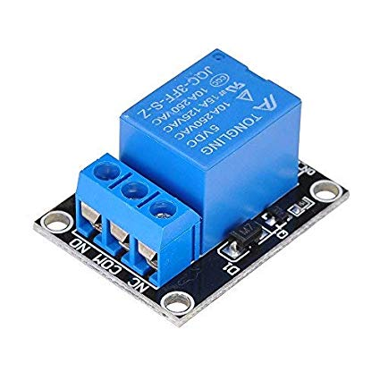
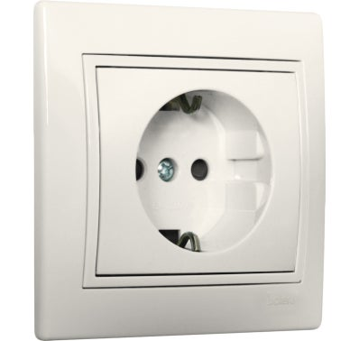
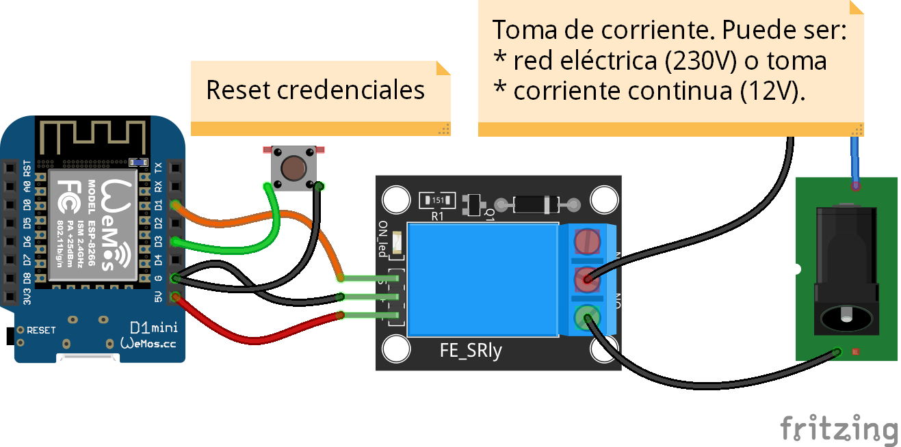
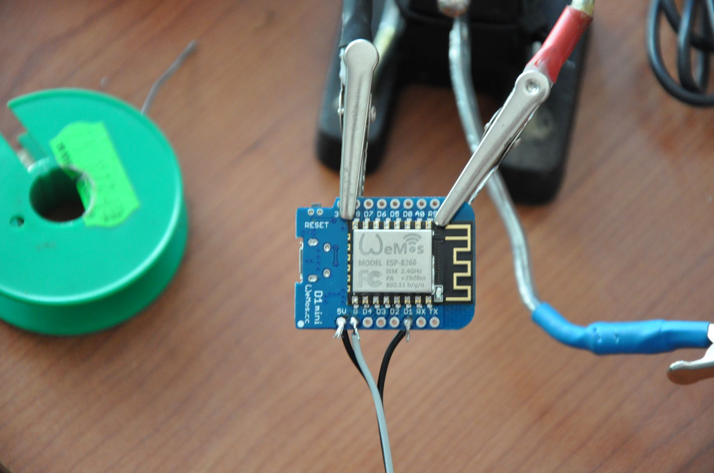

# 1. Introducción
¿Cuantas veces al ir a consultar información al nuestro dispositivo nos vemos con la desagradable experiencia de no tener conexión a internet?
La solución llamar al servicio técnico de la operadora para que nos indique que tenemos que resetear el router, o sea apagar y volver a encender el router. 
En mi caso el router está en el garaje.
# 2. Objeto 
El objetivo de este proyecto es construir un dispositivo que al detectar un fallo en la conexión a internet apague y vuelva a encender e router.
# 3. Materiales necesarios
* WeMos D1 Mini ESP8266 o ESP32
* Relé sólido o mecánico
* Enchufe Schuko
# 4. Funcionamiento

# 5. Componentes electrónicos y eléctricos
* Wemos D1 Mini ESP8266
  

* Módulo Relé mecánico 

* Base de enchufe schuko

# 6. Esquema electrónico

# 7. Manual de usuario

### [Manual de usuario](doc/Manual_Usuario-Router_Reboot.pdf)

# 8. Video 

